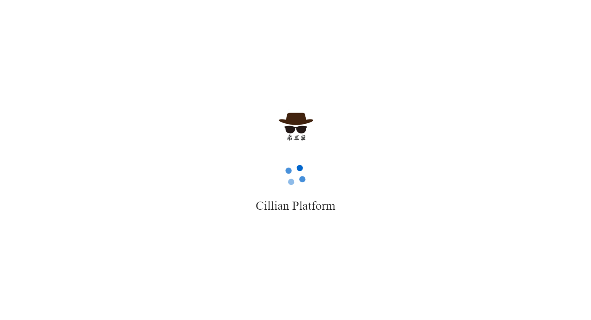
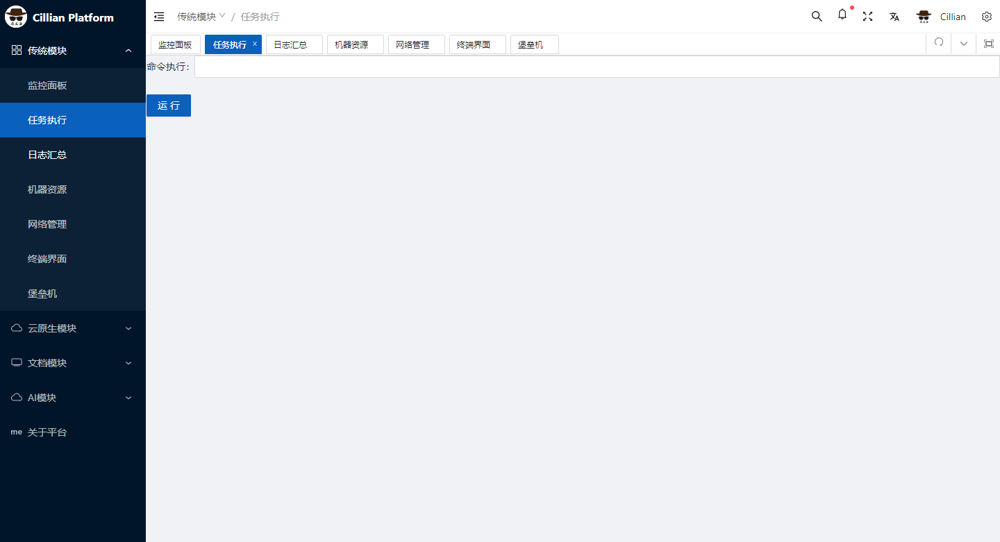
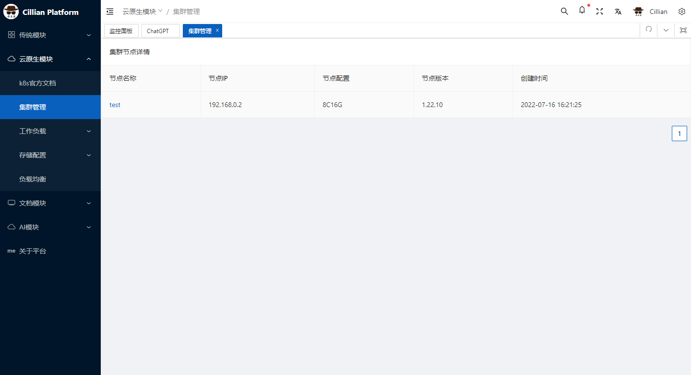
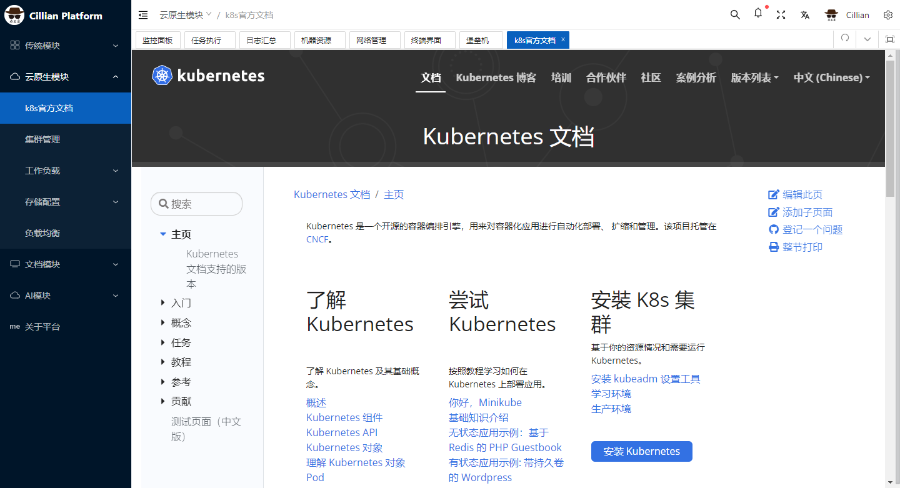
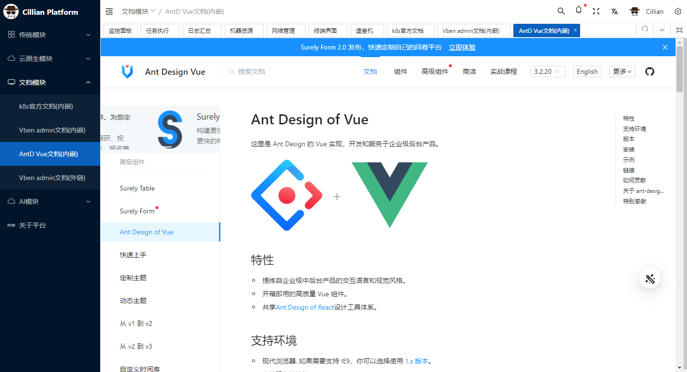
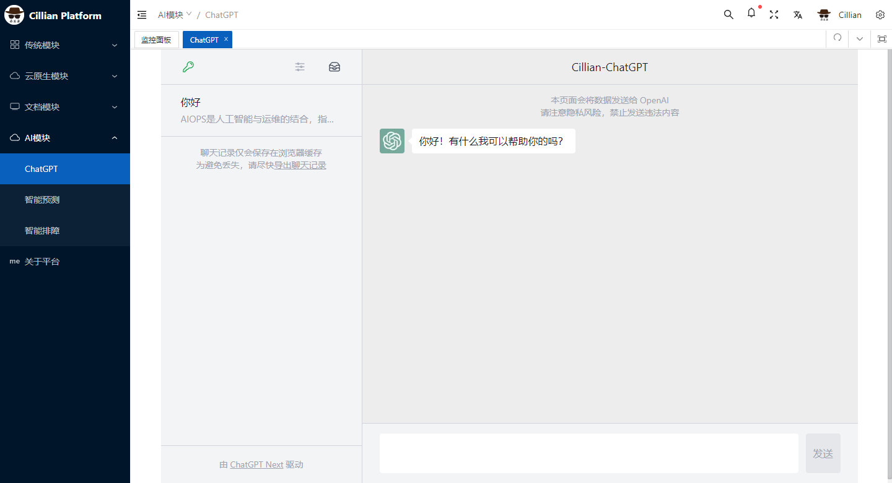

# paltform-go

  
  
  
  

> CillianPlatfrom 智能运维开发管理平台

# 智能运维开发管理平台CillianPlatform

## 主要有四个模块：
## 1、传统模块 
* 监控面板
* 任务执行
* 日志汇总
* 机器资源
* 网络管理
* 终端界面
* 堡垒机
---

### 2、云原生模块
---
* 集群管理
* 工作负载
* 存储配置
* 负载均衡

### 3、文档模块
---

### 4、AI模块
* 智能助手
* 智能预测
* 智能排障
---

---
